# RockyShoes — Technical & Low-Level Design Document

> **Audience:** Entry-level software engineers and new contributors.
> This document explains *everything* about how the RockyShoes e-commerce platform works — from the high-level architecture down to individual API endpoints, database tables, and deployment pipelines.

---

## Table of Contents

1. [Project Overview](#1-project-overview)
2. [Technology Stack](#2-technology-stack)
3. [System Architecture](#3-system-architecture)
4. [Frontend Architecture](#4-frontend-architecture)
5. [Backend Architecture](#5-backend-architecture)
6. [Database Schema](#6-database-schema)
7. [API Design Specifications](#7-api-design-specifications)
8. [Core Workflows & Sequence Diagrams](#8-core-workflows--sequence-diagrams)
9. [Feature Catalog](#9-feature-catalog)
10. [Security & Authentication Model](#10-security--authentication-model)
11. [Progressive Web App (PWA)](#11-progressive-web-app-pwa)
12. [Environment & Deployment](#12-environment--deployment)
13. [Known Constraints & Gotchas](#13-known-constraints--gotchas)

---

## 1. Project Overview

**RockyShoes** is a full-stack, production-ready e-commerce web application for premium footwear. It supports:

- **Customer-facing storefront** — browsing, searching, filtering, wishlisting, and purchasing shoes
- **Secure payment processing** — via Razorpay payment gateway with cryptographic verification
- **Order lifecycle management** — from placement through shipping, delivery, returns, and refunds
- **Admin control panel** — product CRUD, order management, support ticket resolution, and return approvals
- **Customer self-service** — order tracking, return requests, support tickets (Help Desk)
- **Email notifications** — order confirmations, shipping updates, refund receipts, abandoned cart recovery
- **PDF invoice generation** — with GST tax breakdown

### What Problem Does It Solve?

Imagine you want to buy shoes online. This app lets you:
1. Browse a catalog of shoes (sneakers, running shoes, boots)
2. Add them to a shopping cart with size selection
3. Pay securely via Razorpay
4. Track your order as it ships
5. Request a return and get a refund if something is wrong
6. Contact support via an interactive Help Desk

---

## 2. Technology Stack

| Layer | Technology | Purpose |
|-------|-----------|---------|
| **Frontend Framework** | React 18 + Vite | Single-page application (SPA) with hot module replacement |
| **Routing** | React Router v6 | Client-side navigation between pages |
| **State Management** | React Context API | Shared state for Auth, Cart, and Wishlist |
| **Icons** | Lucide React | Lightweight SVG icon library |
| **Styling** | Vanilla CSS | Custom design system with CSS variables |
| **Backend Runtime** | Node.js + Express | REST API server for business logic |
| **Database** | PostgreSQL (Supabase) | Relational database with Row-Level Security |
| **Authentication** | Supabase Auth | JWT-based auth with email/password and Google OAuth |
| **Payments** | Razorpay | Indian payment gateway (UPI, cards, wallets) |
| **Email** | Resend | Transactional email delivery |
| **PDF Generation** | PDFKit | Server-side invoice generation |
| **Rate Limiting** | express-rate-limit | API abuse prevention |
| **Frontend Hosting** | Vercel | Static site hosting with CDN |
| **Backend Hosting** | Render | Node.js server hosting |

### Why These Choices?

- **Supabase** gives us a hosted PostgreSQL database with built-in auth, real-time subscriptions, and Row-Level Security (RLS) — all without managing infrastructure.
- **Razorpay** is the standard payment gateway in India, supporting UPI, cards, and wallets.
- **Vite** is faster than Create React App for development builds.
- **Express** is the simplest and most widely-used Node.js web framework.

---

## 3. System Architecture

The application follows a **split-tier architecture** — the frontend and backend are deployed separately and communicate over HTTPS.

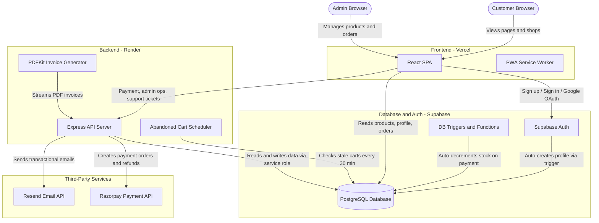

### How Data Flows (Simplified)

1. **Customer visits the site** — React SPA loads from Vercel
2. **Browses products** — React reads directly from Supabase (PostgreSQL)
3. **Adds to cart** — Cart state stored in React Context + localStorage + Supabase `carts` table
4. **Checks out** — React calls Express backend, Express calls Razorpay, payment verified, order saved to Supabase, email sent via Resend
5. **Admin manages orders** — React calls Express admin endpoints (protected by JWT + role check), Express updates Supabase

---

## 4. Frontend Architecture

### 4.1. Directory Structure

```
src/
├── App.jsx                    # Root component with routing
├── main.jsx                   # React entry point
├── index.css                  # Global CSS design system
├── apiConfig.js               # API URL helper (local vs production)
├── supabaseClient.js          # Supabase client initialization
│
├── context/                   # React Context providers (global state)
│   ├── AuthContext.jsx        # User authentication state
│   ├── CartContext.jsx        # Shopping cart state
│   └── WishlistContext.jsx    # Wishlist state
│
├── hooks/
│   └── useDocumentTitle.js    # Custom hook for page titles (SEO)
│
├── components/                # Reusable UI components
│   ├── Navbar.jsx             # Top navigation bar with search
│   ├── Footer.jsx             # Footer with support links
│   ├── CartDrawer.jsx         # Slide-out shopping cart sidebar
│   ├── ProductCard.jsx        # Product card for listings
│   └── SupportModal.jsx       # Customer support modal (Help Desk, FAQs, etc.)
│
└── pages/                     # Route-level page components
    ├── Home.jsx               # Landing page with hero, categories
    ├── Shop.jsx               # Product listing with filters and pagination
    ├── ProductDetail.jsx      # Single product view with size picker
    ├── Profile.jsx            # Customer portal: orders, returns, account
    ├── Checkout.jsx           # Checkout form with promo codes
    ├── OrderSuccess.jsx       # Post-payment success page
    ├── OrderTracking.jsx      # Real-time order tracking page
    ├── AdminDashboard.jsx     # Admin control panel
    └── ResetPassword.jsx      # Password reset page
```

### 4.2. Routing Map

| Path | Page Component | Auth Required? | Description |
|------|---------------|----------------|-------------|
| `/` | `Home` | No | Landing page with featured products |
| `/shop` | `Shop` | No | Full product catalog with filters |
| `/product/:id` | `ProductDetail` | No | Individual product page |
| `/profile` | `Profile` | Yes | Customer account and order history |
| `/checkout` | `Checkout` | No | Checkout form (guest checkout supported) |
| `/order-success` | `OrderSuccess` | No | Payment confirmation page |
| `/track/:orderId` | `OrderTracking` | No | Order tracking (email verification for guests) |
| `/admin` | `AdminDashboard` | Yes (admin) | Admin control panel |
| `/reset-password` | `ResetPassword` | No | Password reset form |

### 4.3. State Management

The app uses three React Context providers that wrap the entire component tree:

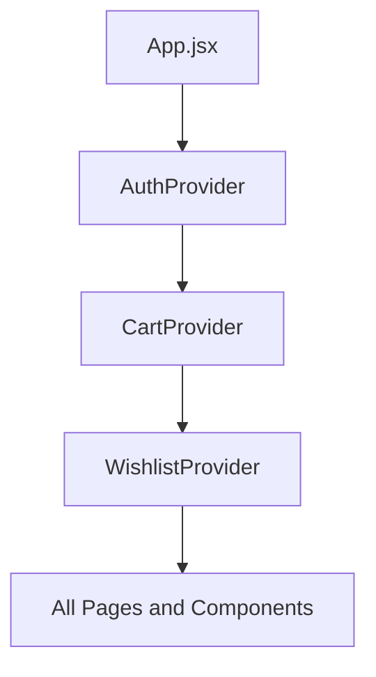

| Context | What It Stores | Persistence |
|---------|---------------|-------------|
| `AuthContext` | Current user, profile, session, login/logout functions | Supabase session (auto-managed) |
| `CartContext` | Cart items, quantities, sizes, cart open/close state | localStorage + Supabase `carts` table |
| `WishlistContext` | Wishlisted product IDs | localStorage |

### 4.4. API URL Configuration

The frontend uses a helper function `apiUrl()` to route API calls correctly in both environments:

```javascript
// src/apiConfig.js
const API_BASE = import.meta.env.VITE_API_URL || '';

export function apiUrl(path) {
  return `${API_BASE}${path}`;
}
```

- **Local development:** `VITE_API_URL` is empty. Calls go to `/api/...`. Vite's dev proxy forwards them to `http://127.0.0.1:5000`
- **Production:** `VITE_API_URL` is set to the Render backend URL (e.g., `https://rocky-shoes.onrender.com`). Calls go directly to the live server

---

## 5. Backend Architecture

### 5.1. Server Setup

The Express server (`server/index.js`) is a single-file backend that handles:

1. **Payment processing** — Creating Razorpay orders and verifying payment signatures
2. **Admin operations** — Product CRUD, order status management, ticket resolution
3. **Customer operations** — Support tickets, return requests, order tracking
4. **PDF generation** — GST-compliant invoice downloads
5. **Email notifications** — Transactional emails via Resend
6. **Background jobs** — Abandoned cart recovery emails (every 30 minutes)

### 5.2. Middleware Stack

```
Request --> CORS --> JSON Parser --> [Rate Limiter] --> [Auth Middleware] --> Route Handler --> Response
```

| Middleware | Purpose | Applied To |
|-----------|---------|------------|
| `cors()` | Allows cross-origin requests from frontend | All routes |
| `express.json()` | Parses JSON request bodies | All routes |
| `paymentLimiter` | Max 10 requests per 15 min per IP | Payment endpoints only |
| `authenticateUser` | Validates JWT, sets `req.user` (allows guest pass-through) | Customer endpoints |
| `requireAdmin` | Validates JWT + checks `profiles.role === 'admin'` | Admin endpoints only |

### 5.3. Third-Party Client Initialization

The server initializes three external clients on startup:

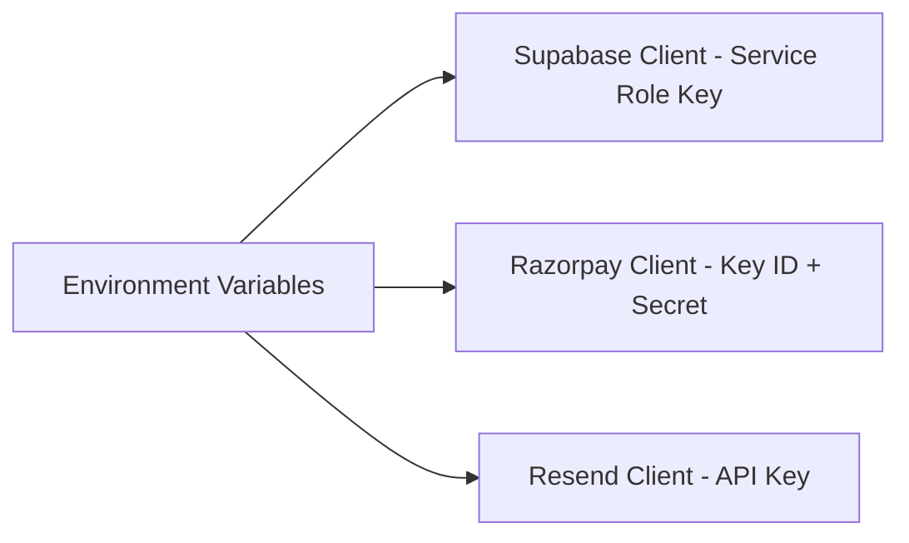

> [!IMPORTANT]
> The server uses the Supabase **Service Role Key** (not the anon key). This bypasses Row-Level Security (RLS) policies, allowing the server to read/write any data. This is intentional — the server is trusted code.

---

## 6. Database Schema

The database is hosted on **Supabase** (managed PostgreSQL). It has **7 tables** and **2 triggers**.

### 6.1. Entity Relationship Diagram

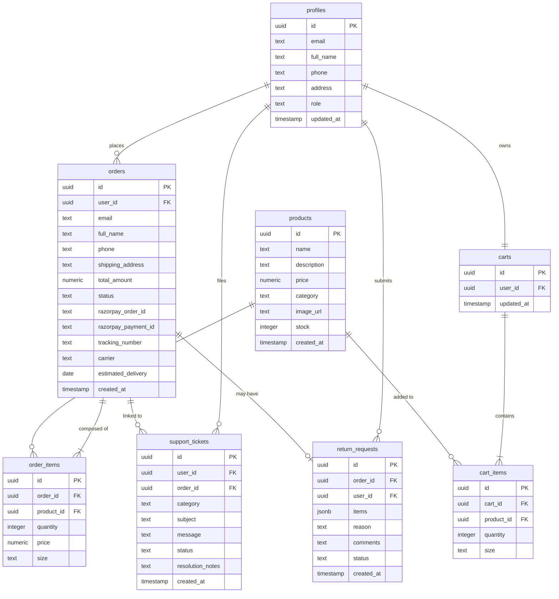

### 6.2. Table Details

#### `profiles`
Linked to Supabase Auth. Every user who signs up automatically gets a row here (via trigger). The `role` column is either `'customer'` (default) or `'admin'`.

#### `products`
The shoe catalog. `category` is constrained to `sneakers`, `running_shoes`, or `boots`. `stock` has a `CHECK (stock >= 0)` constraint.

#### `orders`
Each order has a `status` field that follows a lifecycle:
`pending` → `paid` → `shipped` → `delivered` → `returning` → `returned`

The `user_id` is nullable to support **guest checkout** (customers who buy without creating an account).

#### `order_items`
Join table linking orders to products. Stores the `price` at time of purchase (so it stays correct even if the product price changes later).

#### `carts` and `cart_items`
Persistent server-side cart. When a logged-in user adds items, they are saved to Supabase so the cart survives across devices and sessions.

#### `support_tickets`
Customer help desk tickets. Optionally linked to an order. Admins resolve tickets by setting `status` to `'resolved'` and adding `resolution_notes`.

#### `return_requests`
Self-serve return requests. Each request is for one order (unique constraint on `order_id`). The `items` column is a JSONB array describing which items are being returned.

### 6.3. Database Triggers

| Trigger | Fires On | What It Does |
|---------|----------|--------------|
| `on_auth_user_created` | `INSERT` on `auth.users` | Automatically creates a `profiles` row when a new user signs up |
| `on_order_paid` | `UPDATE` on `orders` | When `status` changes to `'paid'`, iterates `order_items` and decrements `products.stock` |

### 6.4. Row-Level Security (RLS)

Every table has RLS enabled. This means:
- **Without a valid JWT**, database queries return empty results
- **Customers** can only read/write their own data
- **Admins** can read/write all data (enforced via `profiles.role = 'admin'`)
- **The server** bypasses RLS using the Service Role Key

### 6.5. Order Status Lifecycle

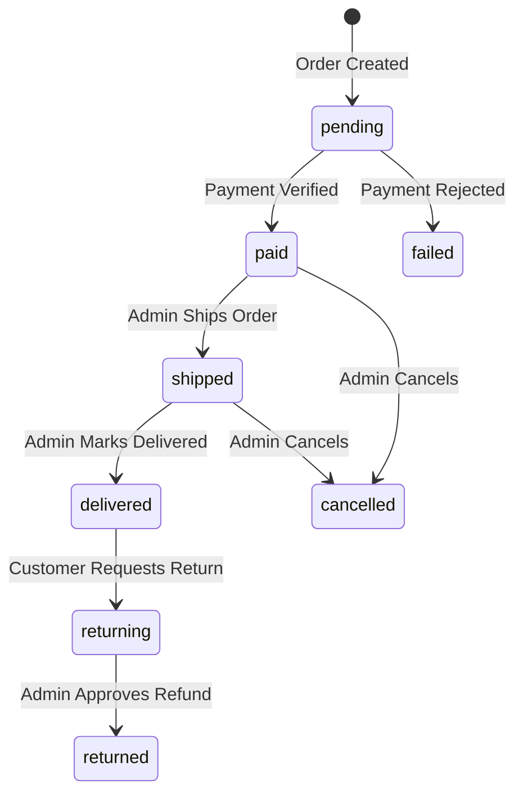

---

## 7. API Design Specifications

The Express backend exposes **16 API endpoints**. All endpoints are prefixed with `/api/`.

### 7.1. Payment Endpoints

| # | Method | Path | Auth | Rate Limited | Description |
|---|--------|------|------|-------------|-------------|
| 1 | `POST` | `/api/payment/order` | User | Yes | Create a Razorpay payment order |
| 2 | `POST` | `/api/payment/verify` | User | Yes | Verify Razorpay payment signature |
| 3 | `POST` | `/api/payment/simulate-success` | User | Yes | Simulate payment success (testing only) |
| 4 | `POST` | `/api/payment/refund` | Admin | No | Process refund via Razorpay |

#### `POST /api/payment/order`
Creates a payment order on Razorpay. The `amount` is in Rupees and gets converted to paise (multiplied by 100) before sending to Razorpay.

**Request:**
```json
{
  "amount": 4999,
  "receipt": "db-order-uuid-here"
}
```
**Response (200):**
```json
{
  "id": "order_Okd8sj3hFsk",
  "entity": "order",
  "amount": 499900,
  "currency": "INR",
  "status": "created"
}
```

#### `POST /api/payment/verify`
Verifies the HMAC-SHA256 signature returned by Razorpay's checkout widget. If valid, updates the order status to `paid` in Supabase.

**Request:**
```json
{
  "razorpay_order_id": "order_Okd8sj3hFsk",
  "razorpay_payment_id": "pay_Oks8skfhsk",
  "razorpay_signature": "signature_hash_here",
  "db_order_id": "db-order-uuid-here"
}
```

**How Signature Verification Works:**
```
expected = HMAC-SHA256(razorpay_order_id + "|" + razorpay_payment_id, RAZORPAY_KEY_SECRET)
if (expected === razorpay_signature) then Payment is legitimate
```

#### `POST /api/payment/simulate-success`
Testing endpoint that bypasses Razorpay and directly marks an order as `paid`. Also sends an order confirmation email. Used during development when you don't want to go through real payment.

**Request:**
```json
{
  "db_order_id": "db-order-uuid-here"
}
```

#### `POST /api/payment/refund`
Admin-only. Triggers a Razorpay refund for a paid or returning order. The flow:
1. Fetches the order from Supabase
2. Validates order status is `paid`, `shipped`, or `returning`
3. Calls Razorpay refund API (or simulates for test payments)
4. Updates order status to `returned`
5. Auto-approves the linked return request
6. Sends refund confirmation email

**Request:**
```json
{
  "order_id": "db-order-uuid-here",
  "amount": 4999
}
```

---

### 7.2. Admin Endpoints

All admin endpoints require a valid JWT belonging to a user with `role = 'admin'` in the `profiles` table.

| # | Method | Path | Description |
|---|--------|------|-------------|
| 7 | `GET` | `/api/admin/orders` | List all orders with items and product details |
| 8 | `POST` | `/api/admin/orders/:id/status` | Update order status, carrier, tracking number |
| 9 | `POST` | `/api/admin/products` | Create a new product |
| 10 | `PUT` | `/api/admin/products/:id` | Update product fields |
| 11 | `DELETE` | `/api/admin/products/:id` | Delete a product |
| 13 | `GET` | `/api/admin/tickets` | List all support tickets with customer info |
| 14 | `POST` | `/api/admin/tickets/:id/resolve` | Resolve a support ticket with notes |
| 16 | `GET` | `/api/admin/returns` | List all return requests with customer and order info |

#### `POST /api/admin/orders/:id/status`
Updates order status and optional shipping details. Empty strings for `tracking_number`, `carrier`, and `estimated_delivery` are converted to `null` before saving — PostgreSQL rejects empty strings for date columns.

**Request:**
```json
{
  "status": "shipped",
  "carrier": "Delhivery",
  "tracking_number": "DEL1847293",
  "estimated_delivery": "2026-07-01"
}
```

When status is set to `shipped`, an email notification is automatically sent to the customer with tracking details.

#### `POST /api/admin/products`
Creates a new product. `price` and `stock` are parsed as numbers on the server side.

**Request:**
```json
{
  "name": "Rocky Running Air",
  "description": "Premium sports shoe",
  "price": 6999,
  "category": "running_shoes",
  "image_url": "/images/running-shoes/img-1.jpg",
  "stock": 25
}
```

#### `POST /api/admin/tickets/:id/resolve`
Resolves a customer support ticket. The admin provides resolution notes.

**Request:**
```json
{
  "resolution_notes": "Refund processed. New item shipped.",
  "status": "resolved"
}
```

---

### 7.3. Customer Endpoints

| # | Method | Path | Auth | Description |
|---|--------|------|------|-------------|
| 5 | `GET` | `/api/orders/:id/invoice` | None | Download PDF invoice |
| 6 | `POST` | `/api/newsletter/subscribe` | None | Subscribe to newsletter |
| 9 | `GET` | `/api/orders/:id` | User or Email | Get order details for tracking |
| 11 | `POST` | `/api/support/tickets` | User | File a support ticket |
| 12 | `GET` | `/api/support/tickets` | User | List user's own tickets |
| 15 | `POST` | `/api/orders/return-request` | User | File a self-serve return request |

#### `GET /api/orders/:id/invoice`
Generates a PDF invoice on-the-fly using PDFKit. The PDF includes:
- Company header with GSTIN number
- Customer billing details
- Itemized product table with quantities and prices
- GST tax breakdown (CGST 9% + SGST 9%)
- Total amount paid

Returns `Content-Type: application/pdf` as a downloadable file.

#### `POST /api/newsletter/subscribe`
Subscribes an email to the newsletter. If successful, sends a welcome email with the `ROCKY10` coupon code.

**Request:**
```json
{
  "email": "customer@example.com"
}
```

#### `GET /api/orders/:id`
Supports both logged-in users and guest tracking:
- **Logged-in user:** Validated via JWT, must match `order.user_id`
- **Guest:** Must provide `?email=customer@example.com` query parameter that matches the order email

Returns full order details including all items with product info.

#### `POST /api/orders/return-request`
Allows customers to request a return for delivered orders. The backend:
1. Verifies the order belongs to the requesting user
2. Checks order status is `delivered` (only delivered orders are returnable)
3. Inserts a `return_requests` record
4. Updates order status to `returning`

**Request:**
```json
{
  "order_id": "uuid-here",
  "items": [
    { "product_id": "uuid", "quantity": 1, "size": "UK 9" }
  ],
  "reason": "damaged",
  "comments": "Box was crushed during delivery"
}
```

Valid reasons: `size_issue`, `wrong_item`, `damaged`, `quality_issue`, `other`

---

### 7.4. Utility Endpoints

| Method | Path | Description |
|--------|------|-------------|
| `GET` | `/api/health` | Health check — returns Supabase and Razorpay connection status |

---

## 8. Core Workflows & Sequence Diagrams

### 8.1. Checkout & Payment Flow

This is the most complex flow in the application. It involves the frontend, backend, Razorpay, and Supabase.

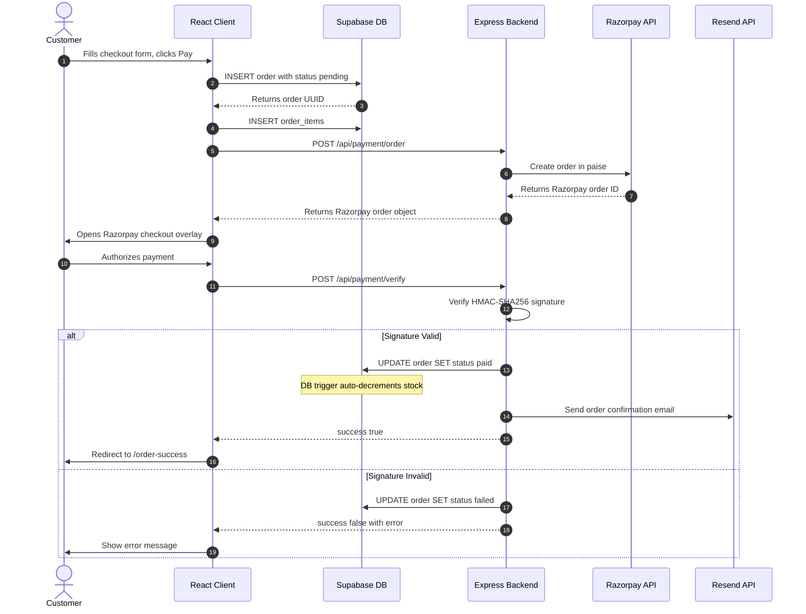

### 8.2. Inventory Auto-Decrement Flow

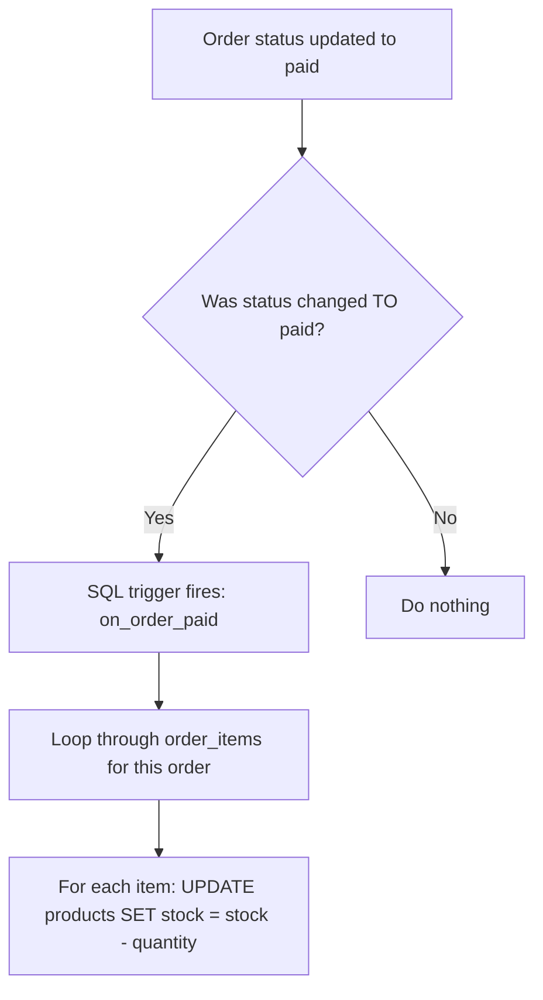

### 8.3. Return Request & Refund Flow

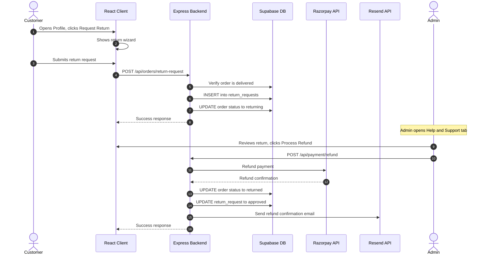

### 8.4. Abandoned Cart Recovery Flow

The server runs a background job every 30 minutes:

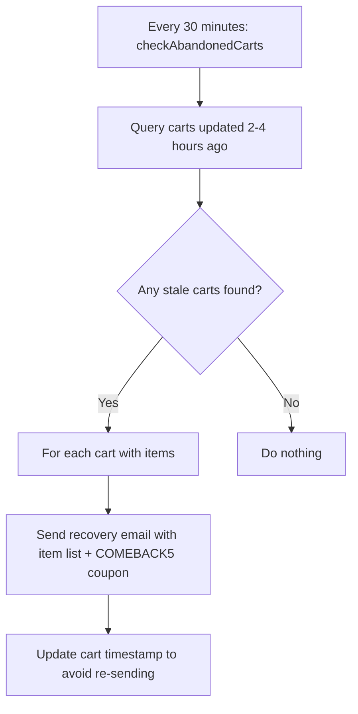

### 8.5. Support Ticket Flow

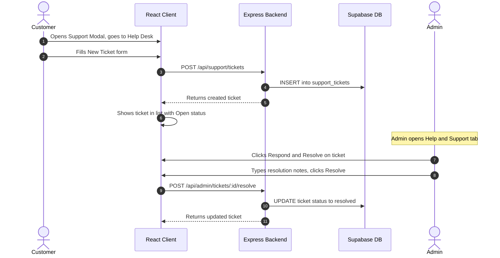

---

## 9. Feature Catalog

### 9.1. Customer Features

| Feature | Page / Component | Description |
|---------|-----------------|-------------|
| **Product Browsing** | `Shop.jsx` | Filter by category (sneakers, running, boots), paginated listing |
| **Product Search** | `Navbar.jsx` | Real-time search across product catalog |
| **Product Detail** | `ProductDetail.jsx` | Image view, size selection (UK 6-12), stock display, add to cart |
| **Shopping Cart** | `CartDrawer.jsx` + `CartContext` | Slide-out sidebar, quantity controls, size display, persisted in localStorage + Supabase |
| **Wishlist** | `WishlistContext` | Heart icon on products, persisted in localStorage |
| **Guest Checkout** | `Checkout.jsx` | Checkout without creating an account |
| **Promo Codes** | `Checkout.jsx` | Apply `ROCKY10` for 10% discount at checkout |
| **Razorpay Payment** | `Checkout.jsx` | Secure payment via Razorpay overlay (UPI, cards, wallets) |
| **Simulated Payment** | `Checkout.jsx` | Testing mode bypasses Razorpay for development |
| **Order Success** | `OrderSuccess.jsx` | Confirmation page with order summary and tracking link |
| **Order History** | `Profile.jsx` | View all past orders with status badges |
| **Order Tracking** | `OrderTracking.jsx` | Visual timeline of order status with carrier and tracking info |
| **Guest Tracking** | `OrderTracking.jsx` | Track orders using order ID + email without login |
| **Return Requests** | `Profile.jsx` | Multi-item return wizard: select items, choose reason, add comments |
| **Help Desk** | `SupportModal.jsx` | File support tickets against orders, view ticket history and resolutions |
| **PDF Invoice** | Via API link | Download GST-compliant PDF invoice for any paid order |
| **Newsletter** | `Footer.jsx` | Subscribe to email newsletter, receive `ROCKY10` coupon |
| **Profile Management** | `Profile.jsx` | Edit name, phone number, shipping address |
| **Password Reset** | `ResetPassword.jsx` | Email-based password reset via Supabase Auth |
| **Google OAuth** | `Profile.jsx` | Sign in with Google account |

### 9.2. Admin Features

| Feature | Location | Description |
|---------|----------|-------------|
| **Dashboard Overview** | `AdminDashboard.jsx` | Revenue metrics, order counts, product stats |
| **Product Management** | `AdminDashboard.jsx` | Create, edit, delete products with stock tracking and image URLs |
| **Order Management** | `AdminDashboard.jsx` | View all orders, update status, add carrier and tracking info |
| **Shipping Notifications** | Backend (auto) | Auto-sends email when order marked as shipped |
| **Return Management** | `AdminDashboard.jsx` | View return requests, review items and reasons, process refunds |
| **Support Tickets** | `AdminDashboard.jsx` | View all customer tickets, respond with resolution notes, mark resolved |
| **Refund Processing** | `AdminDashboard.jsx` | Trigger Razorpay refund for returned orders with email confirmation |

### 9.3. Automated Features (No User Action Required)

| Feature | Trigger | Description |
|---------|---------|-------------|
| **Inventory Decrement** | DB trigger on order paid | Automatically reduces product stock when payment is verified |
| **Profile Creation** | DB trigger on user signup | Automatically creates a `profiles` row from auth user data |
| **Abandoned Cart Email** | Server interval (30 min) | Sends recovery email with `COMEBACK5` coupon to users who left items in cart |
| **Order Confirmation Email** | After payment verification | Sends email with order details and total amount |
| **Shipping Notification Email** | Admin sets status to shipped | Sends email with carrier name, tracking number, estimated delivery |
| **Refund Confirmation Email** | Admin processes refund | Sends email with refund reference ID and amount |

---

## 10. Security & Authentication Model

### 10.1. Authentication Flow

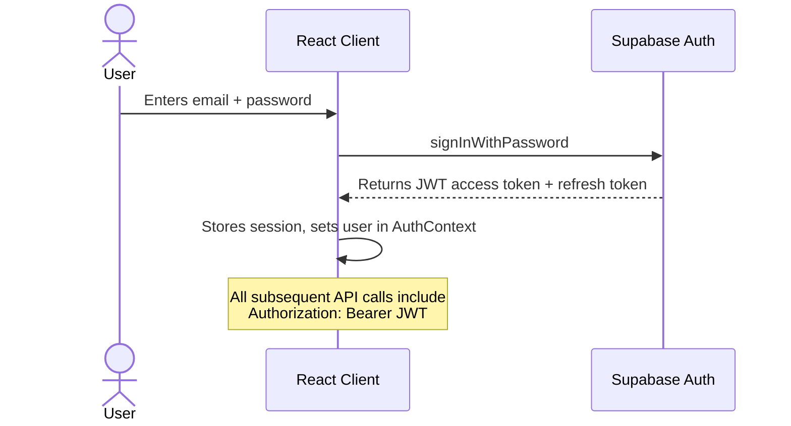

### 10.2. Two-Layer Authorization

| Layer | Middleware | What It Checks |
|-------|-----------|----------------|
| **Authentication** | `authenticateUser` | Validates JWT token via `supabase.auth.getUser(token)`. Allows guest pass-through by setting `req.user = null` |
| **Admin Authorization** | `requireAdmin` | Validates JWT + queries `profiles` table to check `role === 'admin'`. Returns 403 if not admin |

### 10.3. Row-Level Security (RLS) Summary

| Table | Who Can Read | Who Can Write |
|-------|-------------|---------------|
| `profiles` | Everyone | Only own profile |
| `products` | Everyone | Server only (via service role) |
| `orders` | Own orders only | Own orders + Server |
| `order_items` | Own order items (via join) | Insert only + Server |
| `support_tickets` | Own tickets | Own insert + Admin all |
| `return_requests` | Own requests | Own + Admin all |

### 10.4. Payment Security

- Razorpay payment signatures are verified server-side using **HMAC-SHA256**
- The `RAZORPAY_KEY_SECRET` never leaves the server — it is an environment variable
- Failed signature verification marks orders as `failed` in the database
- Rate limiting (10 requests per 15 minutes per IP) prevents payment endpoint abuse

---

## 11. Progressive Web App (PWA)

RockyShoes is configured as an installable PWA:

| File | Purpose |
|------|---------|
| `public/manifest.json` | Defines app name, icons, theme color (`#e11d48`), display mode |
| `public/sw.js` | Service Worker that caches static assets for offline fallback |

The Service Worker:
1. **Install phase:** Caches CSS, JS bundles, fonts, and key images
2. **Fetch phase:** Serves cached content when the network is unavailable
3. **Enables "Add to Home Screen"** on mobile browsers

---

## 12. Environment & Deployment

### 12.1. Environment Variables

| Variable | Used By | Required? | Description |
|----------|---------|-----------|-------------|
| `VITE_SUPABASE_URL` | Frontend + Backend | Yes | Supabase project URL |
| `VITE_SUPABASE_ANON_KEY` | Frontend | Yes | Supabase public/anon key (safe to expose) |
| `SUPABASE_SERVICE_ROLE_KEY` | Backend only | Yes | Supabase admin key (bypasses RLS) |
| `VITE_RAZORPAY_KEY_ID` | Frontend + Backend | Yes | Razorpay public key ID |
| `RAZORPAY_KEY_SECRET` | Backend only | Yes | Razorpay secret key |
| `RESEND_API_KEY` | Backend only | Optional | Resend email API key (emails are simulated if missing) |
| `FRONTEND_URL` | Backend | Optional | Production frontend URL for CORS allowlist |
| `VITE_API_URL` | Frontend | Conditional | Backend URL — empty for local dev, Render URL for production |

> [!CAUTION]
> **Never expose** `SUPABASE_SERVICE_ROLE_KEY` or `RAZORPAY_KEY_SECRET` in frontend code or public repositories. These are server-only secrets.

### 12.2. Local Development Setup

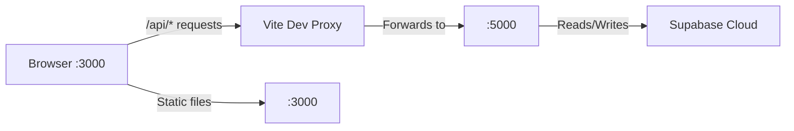

**Steps:**
1. Ensure `.env` has `VITE_API_URL=` (empty value)
2. Run `npm run dev` — starts both Vite (port 3000) and Express (port 5000) concurrently
3. Vite's proxy (`vite.config.js`) forwards `/api/*` calls to `http://127.0.0.1:5000`

### 12.3. Production Deployment

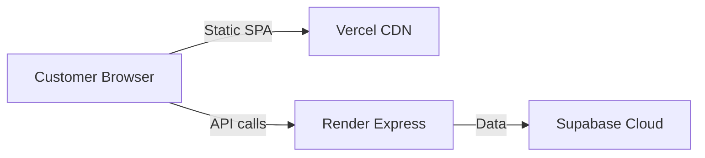

| Service | What It Hosts | Auto-deploys From |
|---------|--------------|-------------------|
| **Vercel** | React SPA (static build) | GitHub `main` branch |
| **Render** | Express API server | GitHub `main` branch |
| **Supabase** | PostgreSQL database + Auth | Always running |

### 12.4. Deployment Checklist

1. **Supabase:** Run `schema.sql` (initial setup) and `database_patch.sql` (adds return/support tables + expands status constraint) in the SQL Editor
2. **Vercel:** Set `VITE_API_URL` env var to your Render backend URL
3. **Render:** Set all backend env vars: `SUPABASE_SERVICE_ROLE_KEY`, `RAZORPAY_KEY_SECRET`, `RESEND_API_KEY`, `FRONTEND_URL`, `VITE_SUPABASE_URL`, `VITE_RAZORPAY_KEY_ID`
4. **Push to GitHub** — Both Vercel and Render auto-deploy from the `main` branch

---

## 13. Known Constraints & Gotchas

| Issue | Cause | Solution |
|-------|-------|----------|
| `invalid input syntax for type date: ""` | PostgreSQL rejects empty strings for `date` columns | Backend converts empty strings to `null` before Supabase update |
| `orders_status_check` constraint violation | Original schema only allows `pending/paid/failed/shipped/cancelled` | Run `database_patch.sql` to add `delivered/returning/returned` |
| `Unexpected token '<', "<!DOCTYPE"` JSON error | Frontend calling live server that does not have latest backend deployed | Ensure `VITE_API_URL` is empty for local dev; push backend changes before testing live |
| Products table `stock` check constraint | Stock cannot go below 0 | Admin should not set stock to negative values |
| Promo code `ROCKY10` is hardcoded | Not database-driven | Works for demo; production should use a `coupons` table |
| Razorpay test mode | Uses test keys, no real money is charged | Switch to live keys for production transactions |
| Resend free tier | Limited to 100 emails/day, single sender domain | Upgrade plan or verify custom domain for production |
| Single-file backend | All endpoints in one `server/index.js` | Consider splitting into route modules as complexity grows |

---

> [!TIP]
> **For new contributors:** Start by reading `App.jsx` for the full routing map, then explore `server/index.js` for the complete backend. The `schema.sql` and `database_patch.sql` files define the entire database structure.
