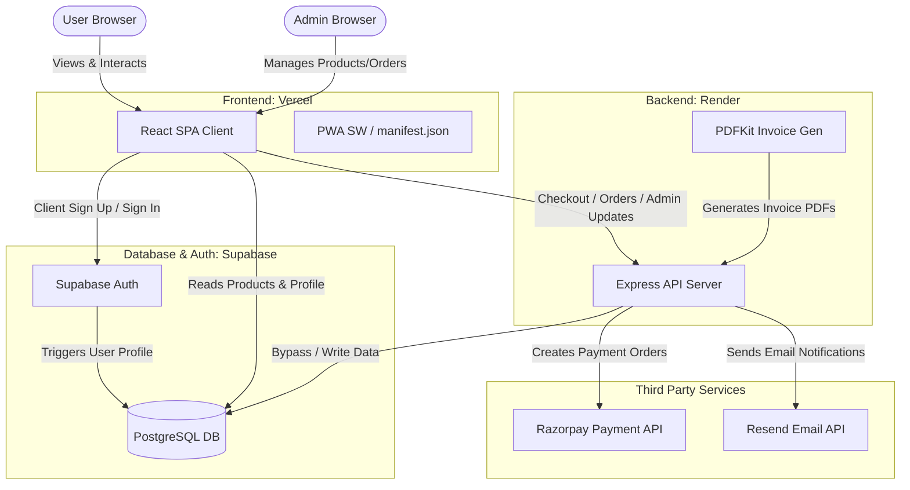
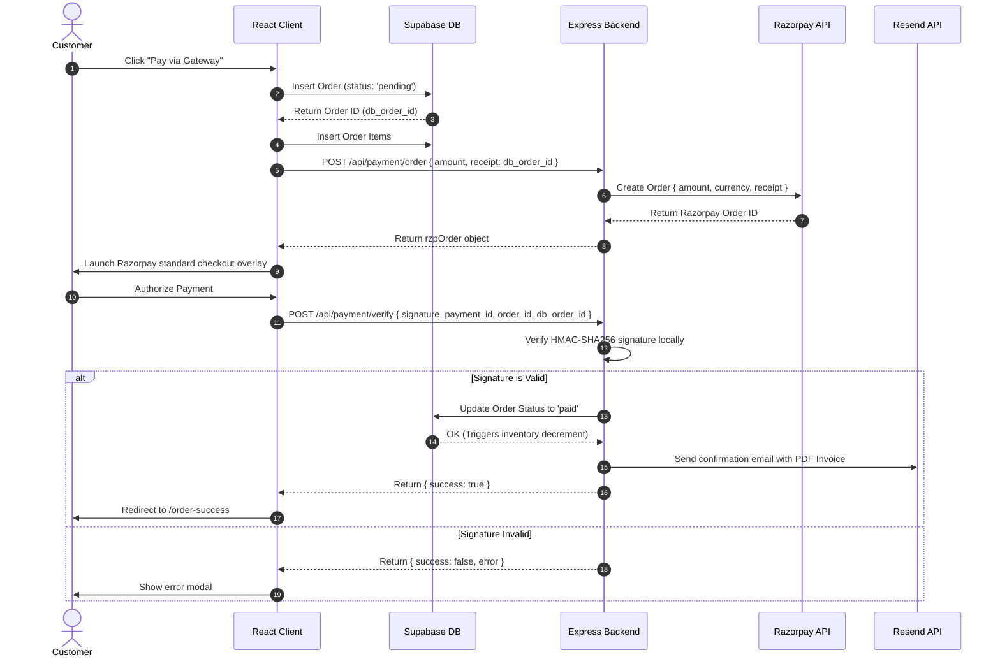
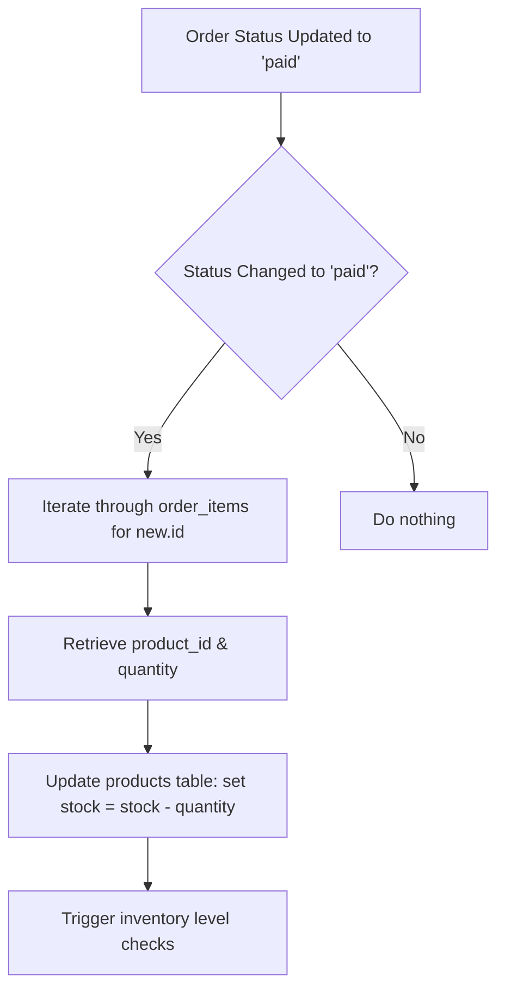
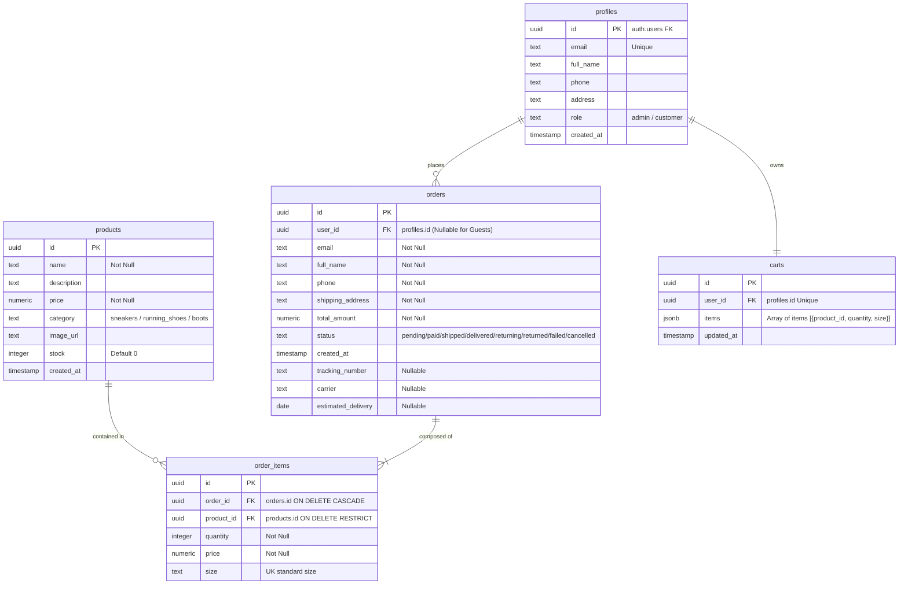

# RockyShoes — Technical & Low-Level Design Document

This document outlines the system architecture, core data flows, database schema, API specifications, and security model of the **RockyShoes** professional e-commerce platform.

---

## 1. System Architecture

The application is built on a split-tier architecture consisting of a static single-page application (SPA), an external serverless backend, and an instant-update database service.



---

## 2. Core Workflows & Sequence Diagrams

### 2.1. Checkout & Payment Verification Workflow (Razorpay)

This flow tracks the creation of orders, payment authorization, database updates, and email notifications.



### 2.2. Product Inventory Auto-Decrement Flow



---

## 3. Database Schema

The relational schema is implemented in Supabase (PostgreSQL) and configured with triggers and foreign keys.



---

## 4. API Design Specifications

The backend Express application acts as an orchestrator for sensitive operations, third-party API keys, and admin validations.

### 4.1. Payment Endpoints

#### `POST /api/payment/order`
Creates an order object on Razorpay.
*   **Headers:** `Content-Type: application/json`
*   **Request Body:**
    ```json
    {
      "amount": 2999,
      "receipt": "db-order-uuid-here"
    }
    ```
*   **Response (200 OK):**
    ```json
    {
      "id": "order_Okd8sj3hFsk",
      "entity": "order",
      "amount": 299900,
      "currency": "INR",
      "receipt": "db-order-uuid-here",
      "status": "created"
    }
    ```

#### `POST /api/payment/verify`
Verifies signature from Razorpay checkout widget.
*   **Request Body:**
    ```json
    {
      "razorpay_order_id": "order_Okd8sj3hFsk",
      "razorpay_payment_id": "pay_Oks8skfhsk",
      "razorpay_signature": "signature_hash_here",
      "db_order_id": "db-order-uuid-here"
    }
    ```
*   **Response (200 OK):**
    ```json
    {
      "success": true,
      "message": "Payment verified and order finalized."
    }
    ```

#### `POST /api/payment/simulate-success`
Bypasses gateways for testing environments.
*   **Request Body:**
    ```json
    {
      "db_order_id": "db-order-uuid-here"
    }
    ```
*   **Response (200 OK):**
    ```json
    {
      "success": true,
      "message": "Simulated payment successful."
    }
    ```

---

### 4.2. Admin Endpoints
*Must be called with Bearer JWT that belongs to a user with the `admin` role in the `profiles` table.*

#### `GET /api/admin/orders`
Retrieves all customer transactions.
*   **Response (200 OK):** Array of order entities including sub-queries of purchased items.

#### `POST /api/admin/orders/:id/status`
Updates shipment metrics, estimated delivery, and carrier details.
*   **Request Body:**
    ```json
    {
      "status": "shipped",
      "carrier": "Delhivery",
      "tracking_number": "DEL1847293",
      "estimated_delivery": "2026-07-01"
    }
    ```

#### `POST /api/admin/products`
Adds a product to the catalog. Price and stock are parsed as numbers on the backend.
*   **Request Body:**
    ```json
    {
      "name": "Rocky Running Air",
      "description": "Premium sports shoe",
      "price": 6999,
      "category": "running_shoes",
      "image_url": "/images/running-shoes/img-1.jpg",
      "stock": 25
    }
    ```

---

### 4.3. Customer Operations

#### `GET /api/orders/:id/invoice`
Generates a PDF invoice download dynamically using `PDFKit` with columns for product name, quantities, calculated taxes (GST), and totals.
*   **Response (200 OK):** Returns raw PDF application stream `Content-Type: application/pdf`.

---

## 5. Security & Authentication Model

### 5.1. Authentication Architecture
1.  **Frontend Authentication:** Managed directly via Supabase Auth (Sign-in, Registration, and Google OAuth). The client maintains access tokens in local storage.
2.  **API Verification Middleware:** 
    - Incoming headers are audited for an `Authorization` JWT: `Bearer <token>`.
    - The token is decrypted using the Supabase JWT Signature Secret.
    - If valid, the user's metadata is injected into `req.user`.

### 5.2. Admin Privilege Middleware (`requireAdmin`)
```javascript
const requireAdmin = async (req, res, next) => {
  try {
    const token = req.headers.authorization?.split(' ')[1];
    if (!token) return res.status(401).json({ error: 'Unauthorized token missing' });

    // Validate the token with Supabase Auth
    const { data: { user }, error } = await supabase.auth.getUser(token);
    if (error || !user) return res.status(401).json({ error: 'Session expired' });

    // Query profiles to inspect role
    const { data: profile } = await supabase
      .from('profiles')
      .select('role')
      .eq('id', user.id)
      .single();

    if (profile?.role !== 'admin') {
      return res.status(403).json({ error: 'Access restricted to administrators' });
    }

    req.user = user;
    next();
  } catch (err) {
    res.status(500).json({ error: 'Authentication internal server error' });
  }
};
```

---

## 6. Progressive Web App (PWA) Configuration

RockyShoes satisfies the PWA requirements for installability and offline support.

1.  **Web App Manifest (`public/manifest.json`):**
    - Defines theme colors (`#ffffff`, `#e11d48`), icons, shortcuts, and displays standard application layout modes.
2.  **Service Worker Cache (`public/sw.js`):**
    - Implements a caching strategy.
    - Caches structural stylesheets, JS dependencies, and brand fonts during the `install` phase.
    - Intercepts requests for cached content when the internet connection is disrupted, enabling fallback pages.
